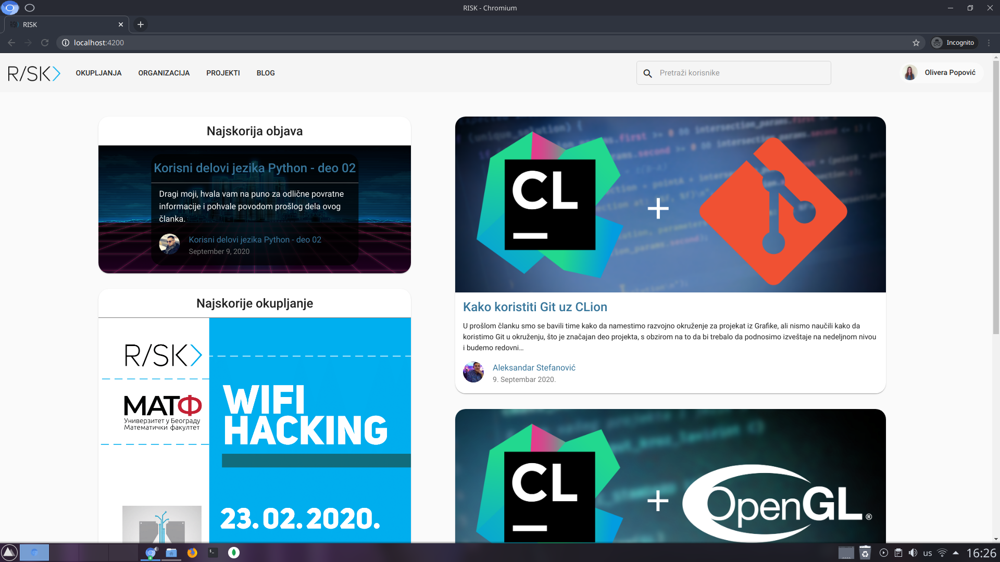

# Project 03-RISK-veb-sajt

Reimplementacija postojećeg veb sajta studentske organizacije RISK uz dodavanje novih funkcionalnosti korisnih studentima MATF-a. Ideja je bila zasnovana na tome da ovo postane mesto za druženje, diskusiju i produbljivanje znanja o oblastima koje su korisne za buduće programere. Jedna od bitnijih funkcionalnosti na koju smo se najviše fokusirali je definitivno poboljšanje već postojećeg bloga, time što će sada svi korisnici moći da doprinesu ovoj zajednici.

## Tehnologije koje su korišćene
### Server
- Node.js
- Express
- MongoDB
- Mongoose
### Klijent
- Angular
- Angular Material

### Dodatno
- Autentikacija
  - token klijenta se čuva u lokalnom skladištu pregledača
  - za određene operacije nad resursima server zahteva autentikaciju
  - korisnici mogu imati privilegije administratora (_npr. mogu dodavati okupljanja_)
- Transformacija slika
- Podrška za tamnu temu pregledača (_prefers-color-scheme_)
- Sadržaj se prilagođava veličini prozora

## Članovi tima

- [Aleksandra Stojanović, 48/2016](https://gitlab.com/alex-x-o)
- [Olivera Popović, 64/2016](https://gitlab.com/popovic-olivera)
- [Aleksandar Stefanović, 479/2017](https://gitlab.com/aleksandar-stefanovic)
